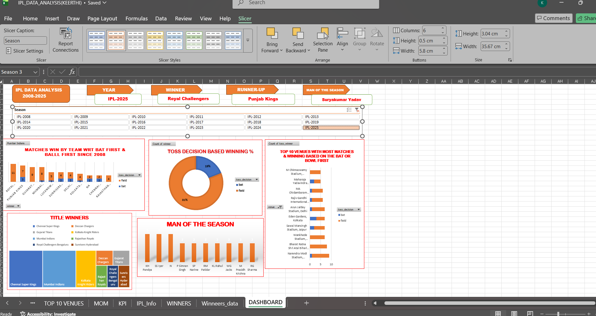

# IPL Performance Dashboard

## Overview
This is my first Excel dashboard project analyzing IPL data.

## Tools Used
- Microsoft Excel
- Pivot Tables
- Charts & Graphs
- Slicers & Filters

## Features
- Total Runs & Wickets KPI
- Team-wise Performance Analysis
- Player-wise Strike Rate Analysis  
- Venue-wise Win % Map using shapes
- Season-wise Trend Analysis 2018-2025
- Interactive Slicers for Season, Team, Player

## Key Insights
- Mumbai Indians had the highest win rate 2018-2025.
- Virat Kohli contributed the most runs in the dataset.
- Wankhede Stadium showed the highest average first innings score.

## Dashboard Preview

